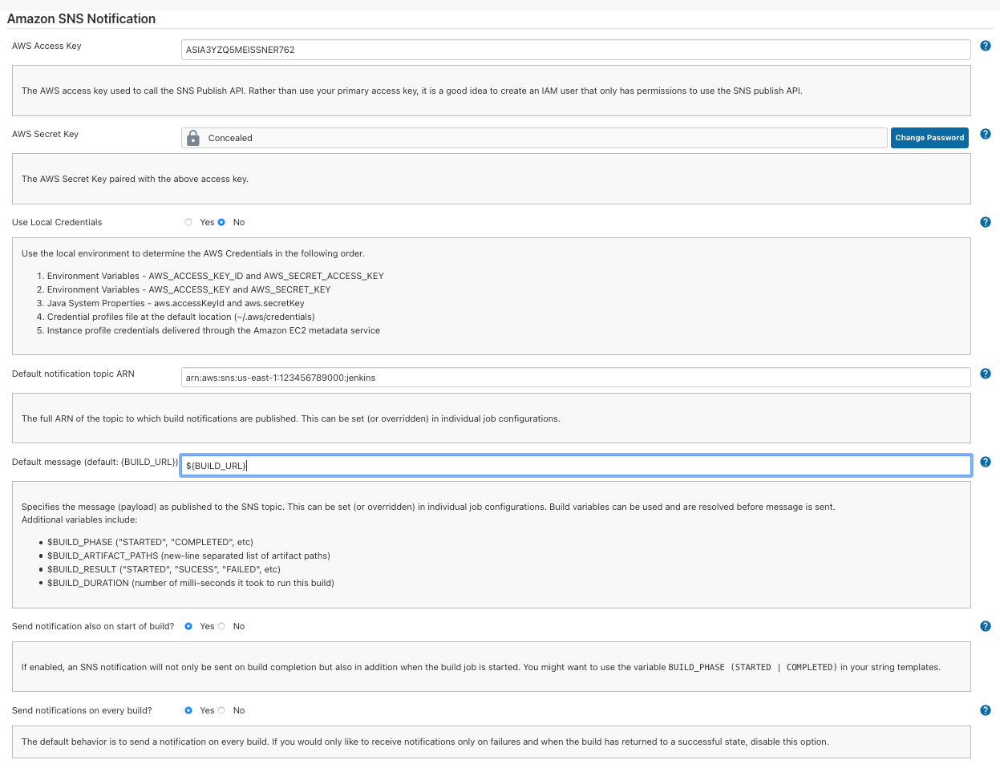
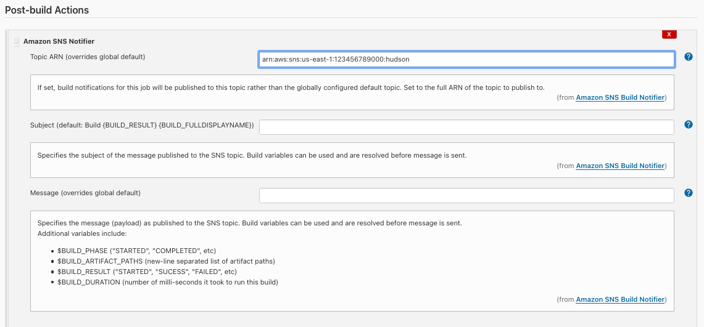

snsnotify-plugin
================

Sends build notifications to an AWS SNS topic as post-build step with
customizable subject and message payload.

1. `git clone https://github.com/jenkinsci/snsnotify-plugin`
2. `cd snsnotify-plugin`
3. `mvn hpi:run`  compile and start Jetty with the Plugin ready to be used

Create an installable artifact:

1. `mvn clean install`
2. (wait for mvn to download the internet)
3. Manage Jenkins > Plugins > Advanced > Upload ```./target/snsnotify.hpi```
4. Restart Jenkins ([$JENKINS_URL]/safeRestart)

Now, login to AWS and do the following:

1. Create an SNS Topic, subscribe a target SQS queue (or create subscription via email etc.)
2. Right-click on targeted SQS queue to confirm subscription 

Finally, back to Jenkins...

1. Manage Jenkins > Configure Jenkins to use AWS creds and newly created Topic ARN.
   You can also specify the default bevaiour in case you want to send out also an 
   SNS notification when the build is started (off by default).
   
2. As part of your job: add post-build step for SNS notification, optionally configure 
   subject and message (you can make use of build and environment variables, which do 
   get substituted), resp. override Topic ARN (if you do not want to stick with globally 
   configured one).
   
   

## helpfull aws snippets

In case you work with more fain grained access controlls, this is an example policy for just publishing to a single topic

```
{
    "Version": "2012-10-17",
    "Statement": [
        {
            "Sid": "AWSConfigSNSPolicy20150201",
            "Action": [
                "SNS:Publish"
            ],
            "Effect": "Allow",
            "Resource": "arn:aws{{just copy the whole arn into this}}"
        }
    ]
}
```
